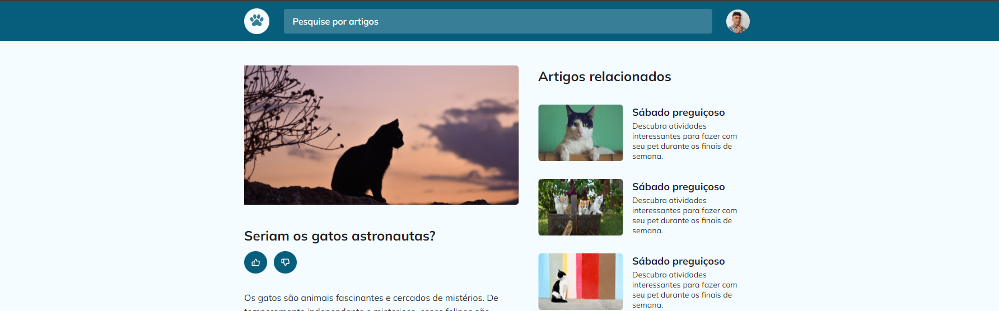

# Cat blogs - Challenge 7

### Description

This is a simple front-end page, created to study responsiveness and grid layouts. This challenge was proposed by [rocketseat](https://www.rocketseat.com.br/) in the explore course.

### 🛠 Technologies and tools

