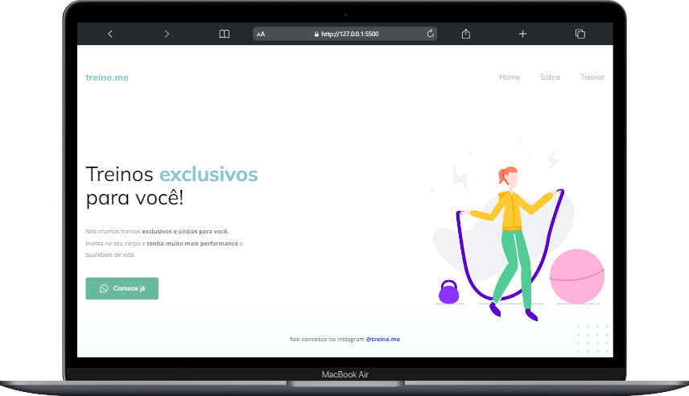

<h1 align="center" style="color: #69B99D">Project 02</h1>
 

    

### 🛠 technologies used

### Description

This project was created to study the reproduction of designs created in `figma`, used semantic tags to create the structure of the page and used `CSS3` to style the page according to the design.

### 📋 subjects studied

* HTML5 semantic tags
* Images in web pages
* Custom fonts
* FlexBox
* Position