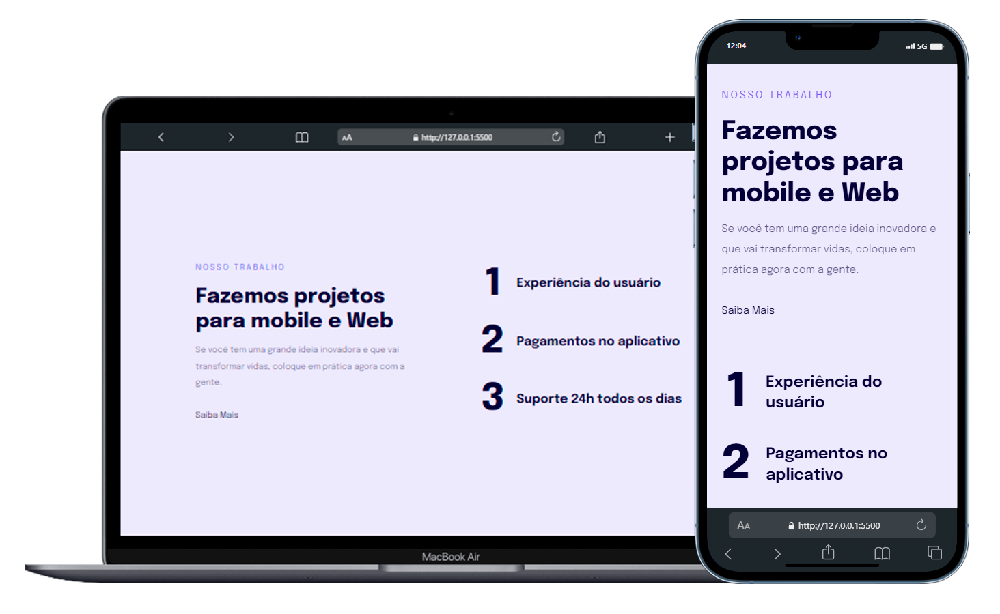

<h1 align="center">
    Project 04
</h1>
 

    

### 🛠 technologies used

### Description

This project was created to study the adaptation of web pages when displayed on different screen sizes, using [`media queries`](https://developer.mozilla.org/pt-BR/docs/Web/CSS/CSS_media_queries/Using_media_queries) to change the layout of the page and the style of the elements that make it up.

### 📋 subjects studied

- HTML5 semantic tags
- Flex Box
- CSS variables
- Media queries
