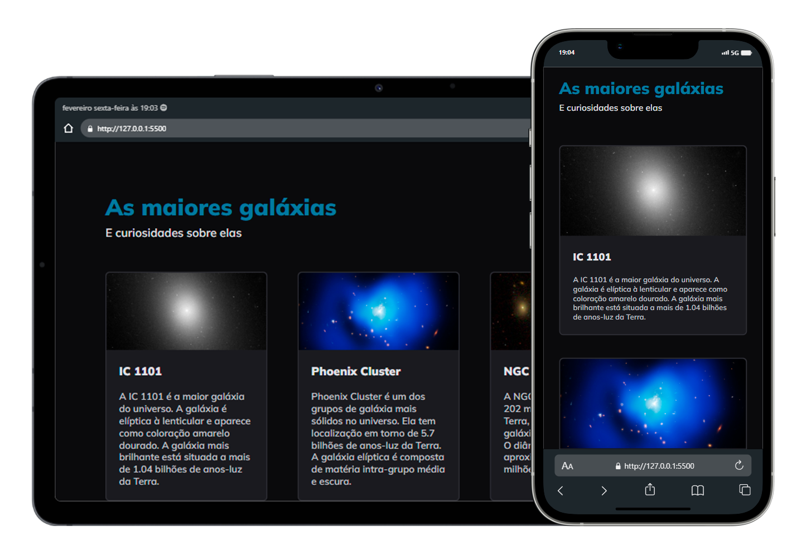

<h1 align="center">
    Project 06
</h1>
 

    

### 🛠 technologies used

### Description

This project was created to study the construction of web pages with a display grid, using [media queries](https://developer.mozilla.org/en-US/docs/Web/CSS/CSS_media_queries/Using_media_queries) to change the layout and adapt the page when displayed on different screen sizes. And it used flexible units of measurement to make the texts responsive.

### 📋 subjects studied

- HTML5 semantic tags
- Grid
- CSS variables
- Media queries
- flexible units